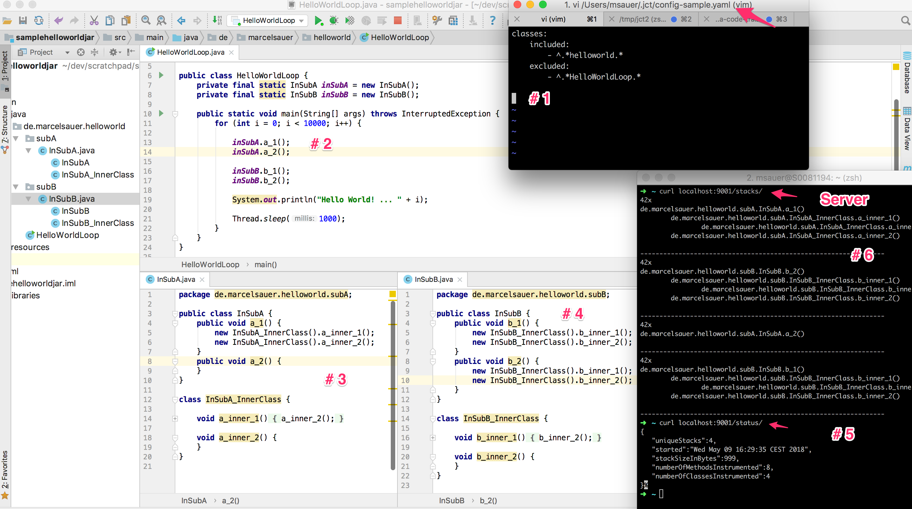

[](http://travis-ci.org/niesfisch/java-code-tracer/builds)

# JCT = Java Code Tracer 

JCT was born out of the idea to collect runtime information from a big monolithic (legacy) application that was running for several years. from time to time there was the same question over and over again:

> do we still need this code? nobody seems to be calling it ....

> but i am still scared to remove it :-(

> maybe the code is called in production?

JCT helps you answering these questions by collecting information about your running application.

# Installing JCT for your application

first clone or download this project

## create config

the config file is the place where you configure which classes and packages of your application should be 'monitored' for calls (aka instrumented). by default nothing will be instrumented as this would produce massive amounts of data. start by choosing a sensible package of your application to  begin with. everything is based on regex(s), so there should be a lot of freedom for you. see the config-sample.yml that you'll be copying to start with.

```bash
mkdir ${HOME}/.jct/
cp config-sample.yaml ${HOME}/.jct/
```

## built the agent jar that will be used

```bash
mvn clean package
ls -al ./target/
```

## start application with agent

(multiline here for better visibility, put everything on one line or escape the linebreaks ;-))

```bash
java -jar someApplication.jar
  -javaagent: /path_to/target/java-code-tracer-1.0-SNAPSHOT-jar-with-dependencies.jar
  -Djct.loglevel=INFO
  -Djct.config=${HOME}/.jct/config-sample.yaml (optional, default is under /src/main/resources/META-INF/config.yaml, will be merged)
  -Djct.tracer.server.port=9002 (default=9001)
  -Djct.logDir=/tmp/jct
  -noverify (needed for the moment)
```
 
## Server with collected information

when the instrumented app starts a background http server will be started that you can connect to

```bash
curl localhost:[port]
   /status/
   /stacks/
   /purge/
```
 
## Logging

Logfile can be found under /tmp/jct/jct_agent.log

# Debugging

if you need more information about what will be instrumented etc. tune the loglevel

```bash
-Djct.loglevel=DEBUG
```

and check the logs ...

# How it works

JCT uses byte code instrumentation. it "magically" weaves tracing information into each instrumented class/method to record calls. it keeps a map of call stacks that it collected and their counts. this is done as long as the instrumented process is running and kept in memory. as soon as the process shuts down, the collected information is gone. 

## Example Hello World walkthrough

In this walkthrough you will start a simple loop that prints "Hello World ..." to the console. the program will be instrumtented with JCT and some data will be collected. here is a screenshot of the program.

	1. config you will use
	2. simple loop that calls some methods on other classes
	3. sample class calling anohter
	4. sample class calling anohter
	5. server with status api
	6. server with stack api

hint: we explicitly excluded the "HelloWorldLoop" in the config otherwise we would never get results as the loop never leaves and JCT never reaches the end of the stack.

files we will use for demo purposes

[config-sample.yaml](doc/config-sample.yaml)

[helloworld-loop.jar](doc/helloworld-loop.jar)



now it's time to start it locally ... 

```bash
# produce jar with agent
mvn clean package
# start hello world jar with agent attached to it
java -Djct.loglevel=INFO -Djct.config=./doc/config-sample.yaml -Djct.tracer.server.port=9001 -Djct.logDir=/tmp/jct2 -noverify -javaagent:"${PWD}/target/java-code-tracer-1.0-SNAPSHOT-jar-with-dependencies.jar" -jar "${PWD}/doc/helloworld-loop.jar"
```

you should see "Hello World .." printed to the console multiple times. 

open another tab ... 

... check the logs

```bash
cat /tmp/jct2/jct_agent.log
```

... and check if you can query the server

```bash
curl http://localhost:9001/status/
curl http://localhost:9001/stacks/
curl http://localhost:9001/purge/
```

# ToDos, Ideas

- do not keep in memory, dump somewhere
- stream events somewhere for processing
- create proper frontend for collected traces
- check/improve performance implications
- check/improve threading issues
- max/minpaths count (prevent heap overflow)
- collect largest min/max-n paths

# License

[MIT](LICENSE.txt)
