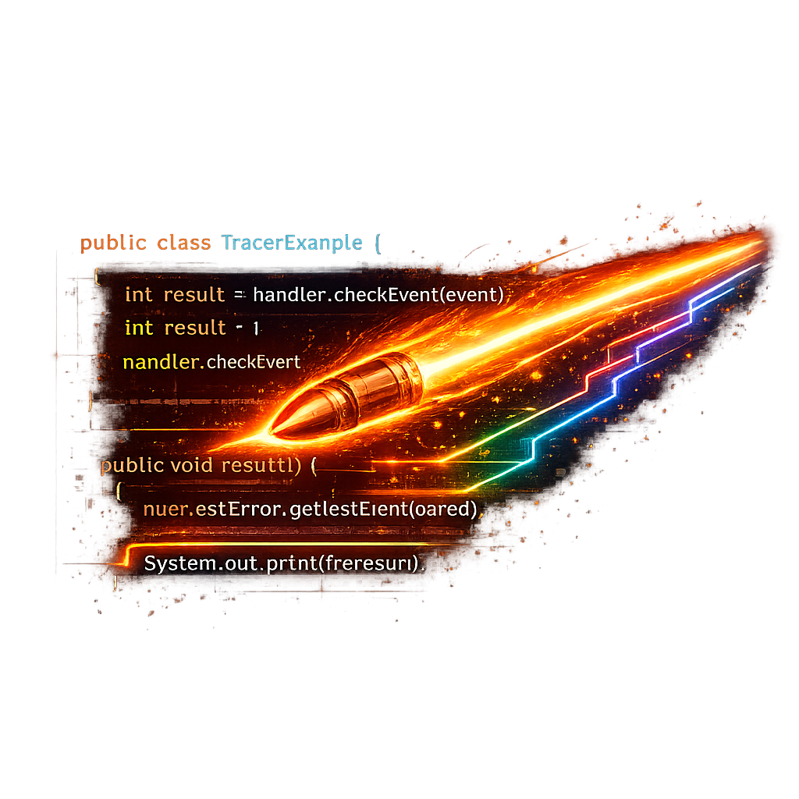
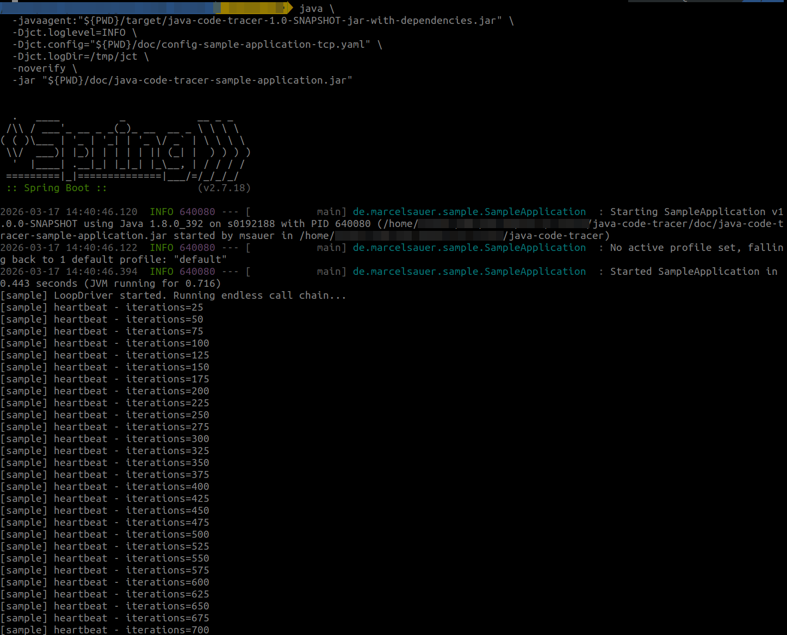
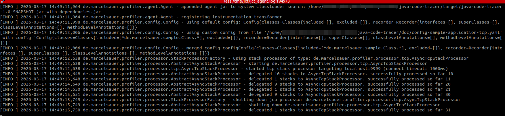
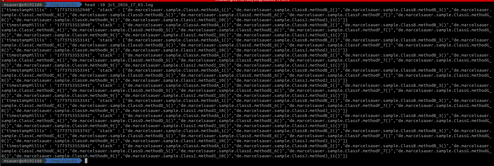
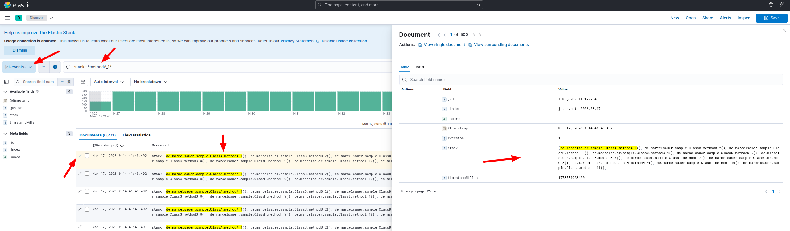
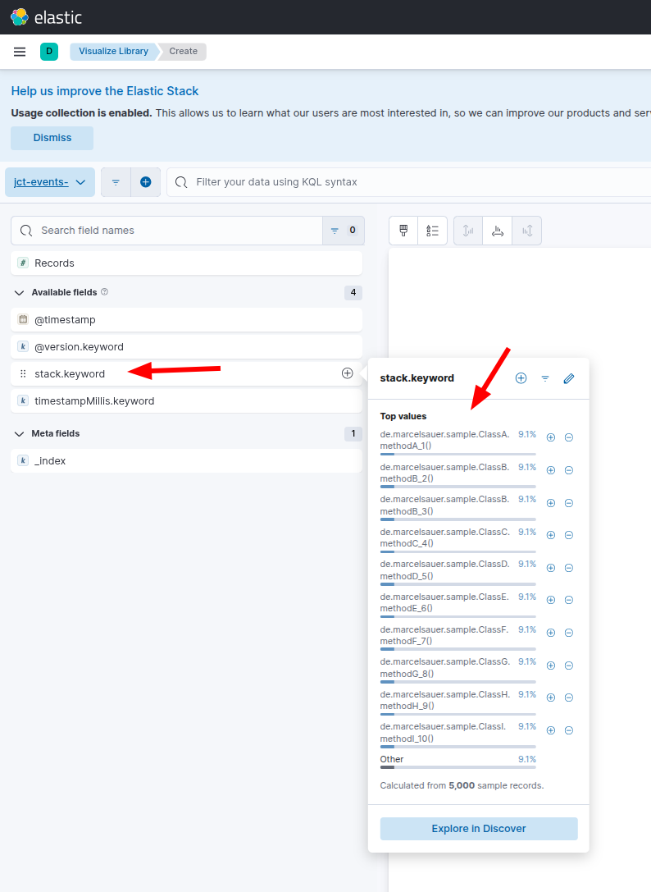
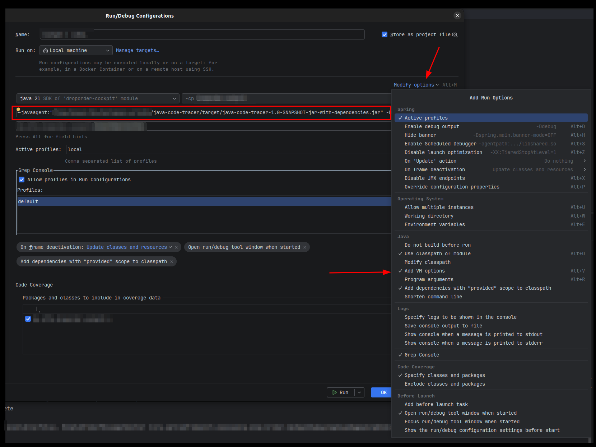

# Java Code Tracer (JCT)

JCT is a Java agent that records real method call stacks while your application is running.

If you work in a legacy app and ask things like "Can we remove this?" or "Is this code path still hit in production traffic?", JCT gives you hard runtime evidence instead of guesses.

## Table of Contents

- [Why This Is Useful in Legacy Systems](#why-this-is-useful-in-legacy-systems)
- [What JCT Does at Runtime](#what-jct-does-at-runtime)
- [Quick Start in 3 Steps](#quick-start-in-3-steps)
- [Recommended Local Workflow: ELK](#recommended-local-workflow-elk)
- [Alternative Stack: ClickHouse + Vector + Grafana](#alternative-stack-clickhouse--vector--grafana)
- [ELK vs. ClickHouse — When to Choose Which](#elk-vs-clickhouse--when-to-choose-which)
- [Project Status](#project-status)
- [Java Version](#java-version)
- [Build](#build)
- [Configure](#configure)
- [Class Include/Exclude Patterns](#class-includeexclude-patterns)
- [Hard-Skipped Packages (Non-Overridable)](#hard-skipped-packages-non-overridable)
- [Run an Application with JCT](#run-an-application-with-jct)
- [Available Processors](#available-processors)
- [Stack Volume Control (All vs New Stacks)](#stack-volume-control-all-vs-new-stacks)
- [Message Format](#message-format)
- [Logging](#logging)
- [Hello World Walkthrough](#hello-world-walkthrough)
- [Tools](#tools)
- [ELK Integration Guide](#elk-integration-guide)
- [Sample Application Screenshots](#sample-application-screenshots)
- [Similar Projects](#similar-projects)
- [IntelliJ JVM Options Example](#intellij-jvm-options-example)
- [License](#license)

## Why This Is Useful in Legacy Systems

In older monoliths and large shared platforms, static code search is usually not enough.

- Feature flags, reflection, and framework magic hide real call paths
- "Unused" code often turns out to be used by one weird but critical flow
- Refactoring without runtime traces is risky and slow

JCT helps you reduce that risk by showing what was actually executed.

## What JCT Does at Runtime

When you attach JCT via `-javaagent`, it does this:

1. Instruments methods that match your include/exclude config
2. Captures call stacks during real execution
3. Sends stack events to a processor (file, UDP or TCP)
4. Lets you inspect those events to validate or reject assumptions

This is especially useful before deleting legacy code, splitting modules, or tightening APIs.

## Quick Start in 3 Steps

If you just want first results quickly:

1. Build JCT
2. Start your app with `-javaagent` and a config
3. Inspect generated events (file output or ELK stack)

Minimum commands:

```bash
mvn clean package
mkdir -p "$HOME/.jct"
cp doc/config-sample-application-file.yaml "$HOME/.jct/config-sample-file.yaml"
java \
  -javaagent:"${PWD}/target/java-code-tracer-1.0-SNAPSHOT-jar-with-dependencies.jar" \
  -Djct.config="$HOME/.jct/config-sample-file.yaml" \
  -Djct.logDir=/tmp/jct \
  -noverify \
  -jar /path/to/your-application.jar
```

Then check `/tmp/jct` logs and your configured processor output.

## Recommended Local Workflow: ELK

For local experimentation, the recommended setup is:

```
  -javaagent:jct.jar            docker compose up
  +-------------------+      +-----------------------------------+
  | App + JCT Agent   |      | Logstash :9999                   |
  | Recorder/Processor|----->|   -> Elasticsearch (jct-events-*)|
  +-------------------+      |   -> Kibana :5601                |
                             +-----------------------------------+
```

This gives you a fast feedback loop: run traffic, query traces, validate code paths.

Start here:

- [README-ELK.md](README-ELK.md)
- [doc/README-ClickHouse-Grafana.md](doc/README-ClickHouse-Grafana.md)

## Alternative Stack: ClickHouse + Vector + Grafana

If you want stronger analytics, faster aggregations over large event volumes, or a lighter-weight alternative to Elasticsearch, JCT also ships a second Docker Compose stack based on ClickHouse + Vector + Grafana.

```
  -javaagent:jct.jar
  +-------------------+
  | App + JCT Agent   |     /tmp/stacks/jct_*.log
  | File Processor    |--+
  +-------------------+  |
                         |   Vector (tail + forward)
                         +-->  ClickHouse: jct_raw
                                    |
                              Materialized View
                                    |
                             jct_events (parsed)
                                    |
                             Grafana :5601
                            (pre-built dashboard)
```

Start here: [doc/README-ClickHouse-Grafana.md](doc/README-ClickHouse-Grafana.md)

## ELK vs. ClickHouse — When to Choose Which

Both stacks run locally via `docker compose` and need no cloud setup.

| Criterion | ELK (Elastic + Kibana) | ClickHouse + Grafana |
|---|---|---|
| **Setup effort** | Medium — three containers, index pattern setup in Kibana UI | Medium — three containers, datasource and dashboard auto-provisioned |
| **Query style** | KQL / Lucene (full-text search focused) | SQL (aggregation and analytics focused) |
| **Best for** | Searching for specific stack occurrences, filtering by text | Aggregating, counting, trending over high volumes |
| **Event volume** | Good up to low millions; indexing is memory-heavy | Excellent for large volumes; columnar storage compresses well |
| **Ad-hoc exploration** | Kibana Discover is fast for browsing raw events | ClickHouse Play UI or Grafana Explore for SQL queries |
| **Dashboard UX** | Kibana Lens (good) | Grafana (good, pre-built panels included) |
| **Transport** | UDP or TCP → Logstash | File processor → Vector tails log files |
| **When to pick** | You are already familiar with Kibana, or want full-text search | You want SQL analytics, hot-frame counts, or handle high traffic |

**Rule of thumb:**
- Not sure which to pick? Start with **ELK** — Kibana's Discover view is the fastest way to browse raw stacks.
- Running a busy system or want to aggregate across thousands of events? Use **ClickHouse + Grafana** — SQL `GROUP BY class_name` queries are instant even on millions of rows.

## Project Status

This project targets Java 8 bytecode and is currently focused on practical runtime tracing for legacy and monolithic applications.

## Java Version

> **Minimum: Java 8**

JCT is compiled against Java 8 (`-source 8 -target 8`) and intentionally uses no APIs beyond that level.
This is a deliberate choice — the primary target is legacy and monolithic systems that are often stuck on older JVMs.

It runs fine on newer JVMs (11, 17, 21, …) without any changes.

## Build

```bash
mvn clean package
```

The distributable agent jar is created at:

- `target/java-code-tracer-1.0-SNAPSHOT-jar-with-dependencies.jar`

## Configure

Create a local config file:

```bash
mkdir -p "$HOME/.jct"
cp doc/config-sample-file.yaml "$HOME/.jct/config-sample-file.yaml"
```

Notes:

- Default config is loaded from `src/main/resources/META-INF/config.yaml`
- If `-Djct.config=...` is set, custom config is merged with default config

## Class Include/Exclude Patterns

JCT uses Java regex patterns to decide which classes are instrumented.

Config keys:

- `classes.included`: allow list (what JCT may instrument)
- `classes.excluded`: deny list (what JCT must never instrument)

How matching works:

1. JCT normalizes class names to dot notation for regex matching (example: `de.marcelsauer.sample.ClassA`).
2. `excluded` is checked first. If any exclude pattern matches, the class is skipped.
3. If not excluded, `included` is checked. If any include pattern matches, the class is instrumented.
4. If no include pattern matches, the class is skipped.

Pattern behavior:

- Patterns are standard Java regex (`String.matches`), so anchors like `^` and `$` are recommended.
- Include patterns are ORed together (`match any include`).
- Exclude patterns are ORed together (`match any exclude`).
- Exclude wins over include when both match the same class.

Example:

```yaml
classes:
  included:
    - ^de.marcelsauer.*
    - ^com.example.legacy.*
  excluded:
    - ^de.marcelsauer.generated.*
    - ^com.example.legacy.internal.*
```

In this example:

- `de.marcelsauer.service.OrderService` -> instrumented (included, not excluded)
- `de.marcelsauer.generated.DtoMapper` -> skipped (excluded wins)
- `org.springframework.context.ApplicationContext` -> skipped (not included)

Practical tips:

- Start narrow (one business package), then widen once you trust the output volume.
- Always exclude generated/proxy-heavy areas you do not need.
- Keep regex explicit; broad patterns like `.*` can produce large event volumes.

## Hard-Skipped Packages (Non-Overridable)

JCT has a built-in safety list of package prefixes that are never instrumented, even if your include regex would match them.
This prevents self-instrumentation and reduces crash risk in JVM/logging/bytecode internals.

Current hard-skipped prefixes (JVM slash notation):

- `de/marcelsauer/profiler/`
- `java/`
- `javax/`
- `jdk/`
- `sun/`
- `com/sun/`
- `org/slf4j/`
- `ch/qos/logback/`
- `org/apache/log4j/`
- `org/apache/logging/log4j/`
- `javassist/`
- `net/bytebuddy/`
- `org/objectweb/asm/`
- `cglib/`
- `org/springframework/cglib/`

Source of truth: `de.marcelsauer.profiler.transformer.Transformer` (`HARD_SKIPPED_PREFIXES`).

## Run an Application with JCT

```bash
java \
  -javaagent:"/path/to/java-code-tracer/target/java-code-tracer-1.0-SNAPSHOT-jar-with-dependencies.jar" \
  -Djct.loglevel=INFO \
  -Djct.config="$HOME/.jct/config-sample-file.yaml" \
  -Djct.logDir=/tmp/jct \
  -noverify \
  -jar /path/to/your-application.jar
```

## Available Processors

JCT currently ships with three output processors.

- `de.marcelsauer.profiler.processor.file.AsyncFileWritingStackProcessor`
  - Writes one JSON event per line into a daily log file (`jct_yyyy_dd_MM.log`) in `processor.stackFolderName`
  - Best when you want the simplest setup, local debugging, or offline analysis
  - Trade-off: local disk I/O and file handling are on you
  - Hint: captured traces can get very large on busy systems, so filesystem usage can grow quickly
  - Sample configs: `doc/config-sample-file.yaml`, `src/test/resources/integration/test-config-asyncfile.yaml`

- `de.marcelsauer.profiler.processor.udp.AsyncUdpStackProcessor`
  - Sends each JSON event as a UDP datagram to `processor.udpHost:processor.udpPort`
  - Best for low overhead streaming to Logstash when occasional loss is acceptable
  - Trade-off: no delivery guarantee; oversized/failed sends are discarded
  - Sample configs: `doc/config-sample-helloworld-udp.yaml`, `src/test/resources/integration/test-config-asyncudp.yaml`

- `de.marcelsauer.profiler.processor.tcp.AsyncTcpStackProcessor`
  - Sends one JSON event per line over TCP to `processor.tcpHost:processor.tcpPort`
  - Reconnects automatically using `tcpConnectTimeoutMillis` and `tcpReconnectDelayMillis`
  - Best when you want stronger delivery behavior than UDP for central ingestion
  - Trade-off: network/backpressure issues can still cause dropped events after failed writes
  - Sample configs: `doc/config-sample-helloworld-tcp.yaml`, `src/test/resources/integration/test-config-asynctcp.yaml`

Quick chooser:

- Pick `file` if you want easiest first success and local evidence fast
- Pick `udp` if you optimize for throughput and can tolerate some loss
- Pick `tcp` if you want better transport reliability for ELK pipelines

## Stack Volume Control (All vs New Stacks)

On busy systems, writing every single captured stack can create huge event volume.
If your main question is only "Was this path hit at least once?", you can report only new stacks.

Processor flags:

- `processor.enableStackDeduplication`
  - `true`: report only first-seen stack hashes within the current dedup window
  - `false` (default): report every captured event
- `processor.dedupResetIntervalMillis`
  - Periodically clears remembered stack hashes to cap memory usage in long-running JVMs
  - In dedup mode (`enableStackDeduplication: true`): if missing, JCT logs a warning and uses `30000` (30 seconds)

Example: report only new stacks (good for high-traffic legacy systems)

```yaml
processor:
  fullQualifiedClass: de.marcelsauer.profiler.processor.udp.AsyncUdpStackProcessor
  udpHost: localhost
  udpPort: 9999
  enableStackDeduplication: true
  dedupResetIntervalMillis: 300000
```

Example: report all stacks (full event stream)

```yaml
processor:
  fullQualifiedClass: de.marcelsauer.profiler.processor.file.AsyncFileWritingStackProcessor
  stackFolderName: /tmp/stacks/
  enableStackDeduplication: false
```

## Message Format

```json
{
	"stack": [
		"de.marcelsauer.sample.ClassA.methodA_1()",
		"de.marcelsauer.sample.ClassB.methodB_2()",
		"de.marcelsauer.sample.ClassB.methodB_3()",
		"de.marcelsauer.sample.ClassC.methodC_4()",
		"de.marcelsauer.sample.ClassD.methodD_5()",
		"de.marcelsauer.sample.ClassE.methodE_6()",
		"de.marcelsauer.sample.ClassF.methodF_7()",
		"de.marcelsauer.sample.ClassG.methodG_8()",
		"de.marcelsauer.sample.ClassH.methodH_9()",
		"de.marcelsauer.sample.ClassI.methodI_10()",
		"de.marcelsauer.sample.ClassJ.methodJ_11()"
	],
	"timestampMillis": "1528120883697"
}
```

- `timestampMillis`: timestamp in milliseconds when the recorded stack entry started
- `stack`: ordered stack frames from entry to exit point

## Logging

JCT writes logs to the directory configured with `-Djct.logDir`.

For more instrumentation details, increase log level:

```bash
-Djct.loglevel=DEBUG
```

Hint: `DEBUG` is useful when you want to see what happens behind the scenes (for example class matching, instrumentation attempts, and skipped classes).

## Sample Application Walkthrough

Build the sample app jar to `doc/java-code-tracer-sample-application.jar`:

```bash
cd sample_application && mvn clean package && cd ..
```

Then run it with the agent from the repository root (`java-code-tracer`):

```bash
java \
  -javaagent:"${PWD}/target/java-code-tracer-1.0-SNAPSHOT-jar-with-dependencies.jar" \
  -Djct.loglevel=INFO \
  -Djct.config="${PWD}/doc/config-sample-application-file.yaml" \
  -Djct.logDir=/tmp/jct \
  -noverify \
  -jar "${PWD}/doc/java-code-tracer-sample-application.jar"
```

> **Note on class patterns:** JCT emits a stack trace only when the *outermost* tracked frame returns. If you include a class whose method runs forever (like `main()` or an endless loop driver), no traces will ever be written. Use a pattern that targets the inner chain classes — see `doc/config-sample-application-file.yaml` for an example using `^de.marcelsauer.sample.Class.*`.

Check agent logs:

```bash
cat /tmp/jct/jct_agent.log
```

Check captured stacks:

```bash
cat /tmp/stacks/jct_*
```

## Tools

### Stack Formatter (`tools/format_stack.py`)

Pretty-prints a raw JCT `stack` array into an aligned, human-readable call sequence.

Requires Python 3.9+, no dependencies.

```bash
# pipe the bracket string directly
echo '[a.b.Foo.bar(), a.b.Foo.baz()]' | python3 tools/format_stack.py

# from a file
python3 tools/format_stack.py stack.txt

# grab from clipboard (Linux)
xclip -o | python3 tools/format_stack.py
```

Example output:

```
   #  package                class   method
  ─────────────────────────────────────────────────────────────────────────
   1  de.marcelsauer.sample  ClassA  .methodA_1()
   2  de.marcelsauer.sample  ClassB  .methodB_2()
   3                                 .methodB_3()
   4  de.marcelsauer.sample  ClassC  .methodC_4()
   5  de.marcelsauer.sample  ClassD  .methodD_5()
   6  de.marcelsauer.sample  ClassE  .methodE_6()
   7  de.marcelsauer.sample  ClassF  .methodF_7()
   8  de.marcelsauer.sample  ClassG  .methodG_8()
   9  de.marcelsauer.sample  ClassH  .methodH_9()
  10  de.marcelsauer.sample  ClassI  .methodI_10()
  11  de.marcelsauer.sample  ClassJ  .methodJ_11()
```

## ELK Integration Guide

For local Elasticsearch + Logstash + Kibana setup (Docker), UI access, data view setup, and log exploration, see the dedicated guide:

- [README-ELK.md](README-ELK.md)
- [README-analysis-ELK.md](README-ELK-analysys.md)

## Sample Application Screenshots

### Start with agent

### JCT logs after start

### Captured stacks if AsyncFileWritingStackProcessor is configured

### Captured stacks in Kibana 'Discover' View if ELK stack is used 

### Captured stacks in Kibana 'Visualization/Lens' View if ELK stack is used 


## Similar Projects

- [Datadog dd-trace-java](https://github.com/DataDog/dd-trace-java/)
- [New Relic](https://newrelic.com/)
- [java-callgraph](https://github.com/gousiosg/java-callgraph)

## IntelliJ JVM Options Example

Use the following IntelliJ Run/Debug VM options example when attaching JCT as a Java agent:



## License

[MIT](LICENSE.txt)

